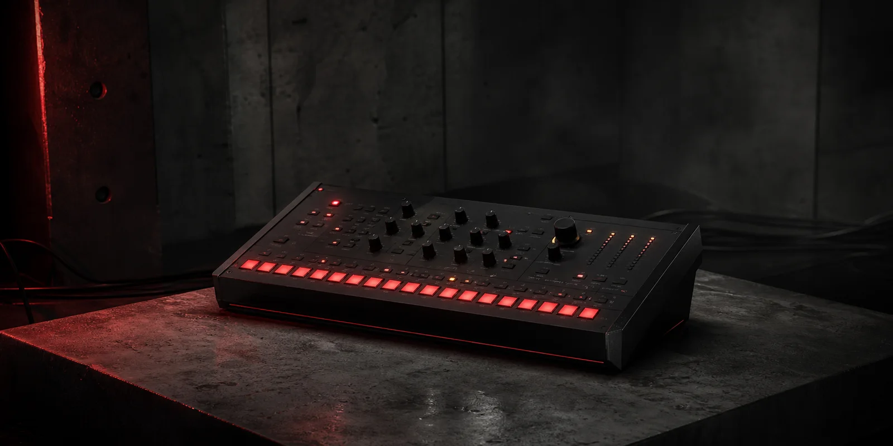
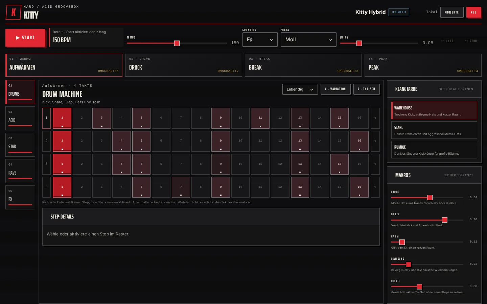
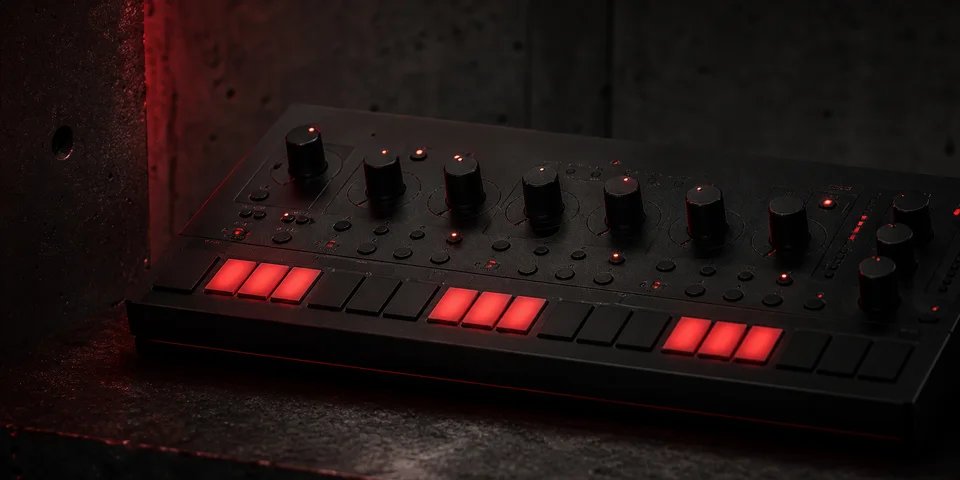
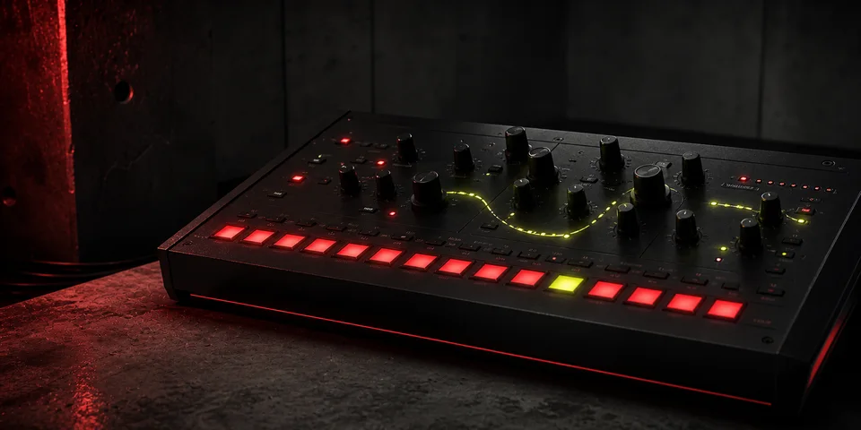
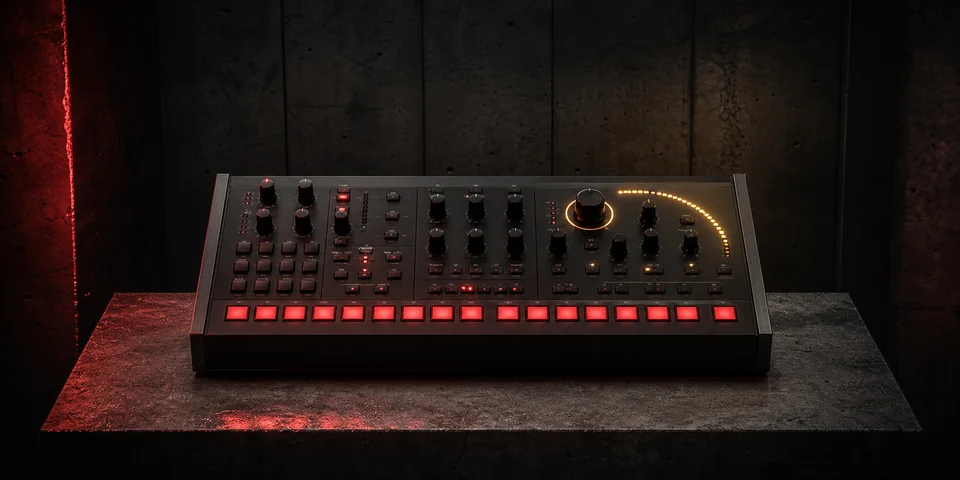

# Kitty

[](https://theanonymous.github.io/Kitty/)

Kitty ist eine anfängerfreundliche, vollständig clientseitige Hard-/Acid-
Techno-Groovebox. Sie läuft ohne Konto, Backend, Samples oder externe Requests
in einem aktuellen Chromium-Browser. Alle Klänge werden lokal mit Tone.js
synthetisiert, Projekte bleiben im `localStorage` des Browsers.

**[Kitty direkt im Browser öffnen](https://theanonymous.github.io/Kitty/)**

## Loslegen

Voraussetzungen sind exakt Node.js 24.15.0 und npm 12.0.0.

```bash
npm ci
npm run dev
```

Die verbindliche Desktop-Größe beginnt bei 1024 × 720. Für die vollständige
lokale Abnahme:

```bash
npm run verify
```

## Oberfläche

[](https://theanonymous.github.io/Kitty/)

## Werkprofile

| Hard | Acid | Hybrid |
| --- | --- | --- |
|  |  |  |
| **155 BPM · F-Phrygisch**<br>Druckvolle Warehouse-Patterns | **145 BPM · A-Moll**<br>Dominante 303-Linien | **150 BPM · Fis-Moll**<br>Hard und Acid im Gleichgewicht |

## Bedienung

- `Leertaste`: Start/Stop
- `1–5`: Drum Machine, Acid Bass, Stab, Rave Lead, Texture/FX
- `Umschalt+1–4`: Szene auswählen oder an der nächsten Taktgrenze vormerken
- `V`: Variation in der gewählten Stärke
- `R`: typisches Pattern für Spur und Profil
- `Strg/Cmd+Z`, `Strg/Cmd+Umschalt+Z` oder `Strg/Cmd+Y`: Undo/Redo
- Klick oder Enter: vorhandenen Step auswählen, freien Step aktivieren
- `Step ausschalten`: den im Detailbereich ausgewählten Step entfernen

Die Profile Hard, Acid und Hybrid werden ausschließlich beim bewussten
Erstellen eines neuen Projekts angewendet. Spätere Änderungen an Tempo,
Grundton oder Skala verändern das gespeicherte Profil und andere Projekte nicht.

## Architektur

Das npm-Workspace trennt die Vue-App in `apps/kitty` vom lokalen
`@kinky-vibes/ui`-Snapshot in `packages/ui`. Domainmodell, musikalischer
Generator, Sanitizing, Store, Speicherung, Bar-Queue und Tone.js-Engine sind
frameworkunabhängig; Vue-Komponenten bilden nur die Bedienoberfläche.

Der Speicher verwaltet höchstens acht benannte Projekte. Primärstände und die
jeweils letzte gültige Sicherung liegen unter versionierten `kitty.*.v1`-
Schlüsseln. Fremde oder beschädigte Werte werden vor Store und Audio-Engine in
die feste Struktur aus vier Szenen, fünf Spuren, vier Takten und 16 Steps
rekonstruiert und geklemmt.

## GitHub Pages

Die aktuelle Version läuft unter
**[theanonymous.github.io/Kitty](https://theanonymous.github.io/Kitty/)**.
Vite baut mit dem Basis-Pfad `/Kitty/`. Bei jedem Push auf `main` prüft der
gepinnte Workflow Lint, Typen, Unit-/A11y-Tests, Build und Chromium-E2E, bevor
er das offizielle Pages-Artefakt veröffentlicht.

## Grenzen von V1

Kein Backend, Cloud-Sync, Arrangement, MIDI, Sample-Import, Audioexport,
Projektdatei-Import/-Export oder PWA. Smartphone, Tablet, Firefox und Safari
sind nicht Teil der verbindlichen Abnahme.

Kitty steht unter der MIT-Lizenz. Herkunft und Lizenzen eingebetteter Assets
sind in [THIRD_PARTY_NOTICES.md](THIRD_PARTY_NOTICES.md) dokumentiert.
