# Kitty

[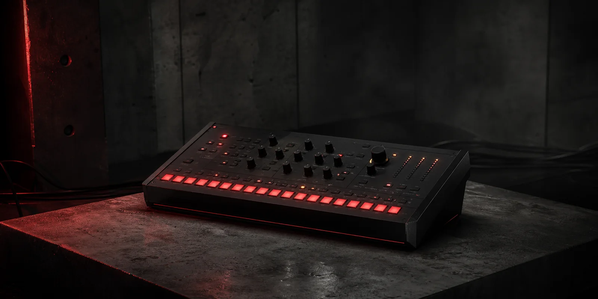](https://musik.jodie-oesterling.de/Kitty/)

Kitty ist eine anfängerfreundliche, vollständig clientseitige Hard-/Acid-
Techno-Groovebox. Sie läuft ohne Konto, Backend, Samples oder externe Requests
in einem aktuellen Chromium-Browser. Alle Klänge werden lokal mit Tone.js
synthetisiert, Projekte bleiben im `localStorage` des Browsers.

**[Kitty direkt im Browser öffnen](https://musik.jodie-oesterling.de/Kitty/)**

**[Visual Gallery und Press Kit ansehen](docs/GALLERY.md)**

## Loslegen

Voraussetzungen sind exakt Node.js 24.15.0 und npm 12.0.0; beides legt
[`mise.toml`](mise.toml) fest (`mise install`).

```bash
npm ci
npm run dev
```

Die verbindliche Desktop-Größe beginnt bei 1024 × 720. Für die vollständige
lokale Abnahme:

```bash
npm run verify
```

Die Browser-Suite aktiviert den Offline-Audiotest nur auf localhost mit
`?audio-test=1`; Laden, Wiedergabe, WAV-Export und Handy-Seite laufen zusätzlich
in Firefox. Ändert sich der Klang (Engine, Presets, Mix), gehört vor die
Veröffentlichung die **[Hörprüfung in 18 Punkten](docs/SOUND_POLISH_HEARING_MATRIX.md)**;
verbindlich ist in jedem Fall `npm run verify`.

## Oberfläche

[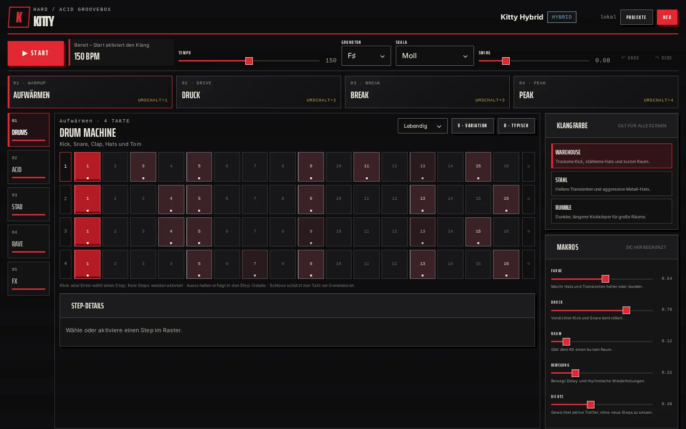](https://musik.jodie-oesterling.de/Kitty/)

## Werkprofile

| Hard | Acid | Hybrid |
| --- | --- | --- |
| 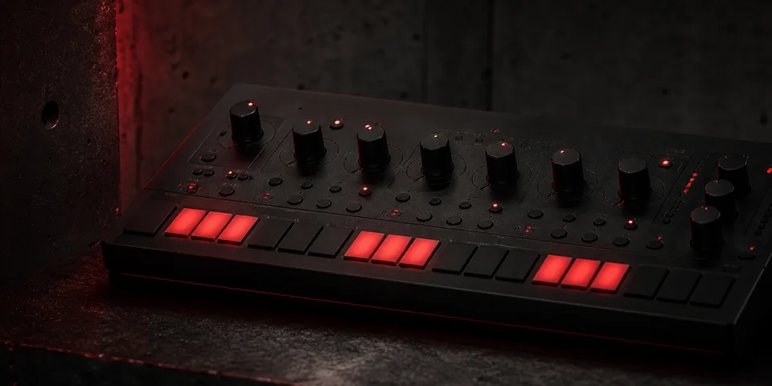 | 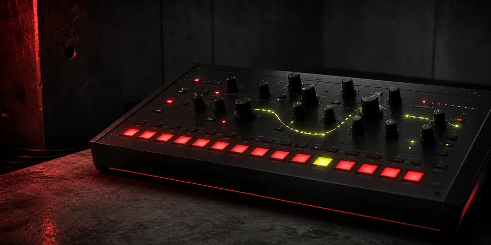 | 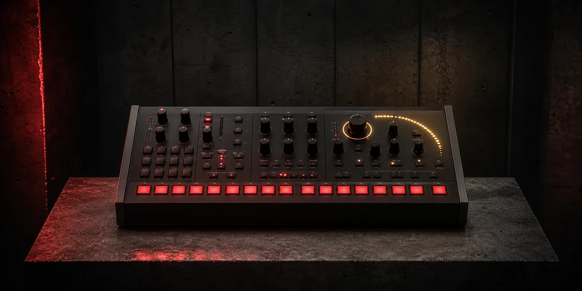 |
| **155 BPM · F-Phrygisch**<br>Druckvolle Warehouse-Patterns | **145 BPM · A-Moll**<br>Dominante 303-Linien | **150 BPM · Fis-Moll**<br>Hard und Acid im Gleichgewicht |

## Instrumentrollen

| Drum Machine | Acid Bass | Stab | Rave Lead | Texture / FX |
| --- | --- | --- | --- | --- |
| 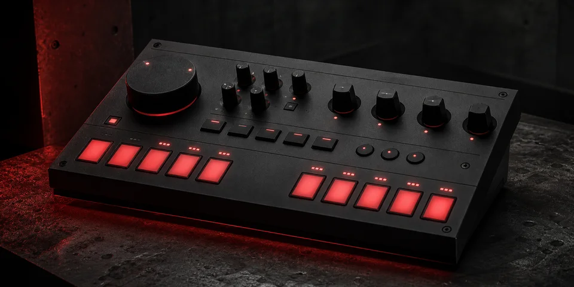 | 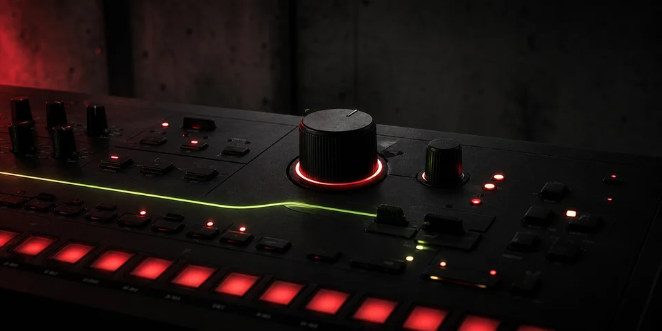 | 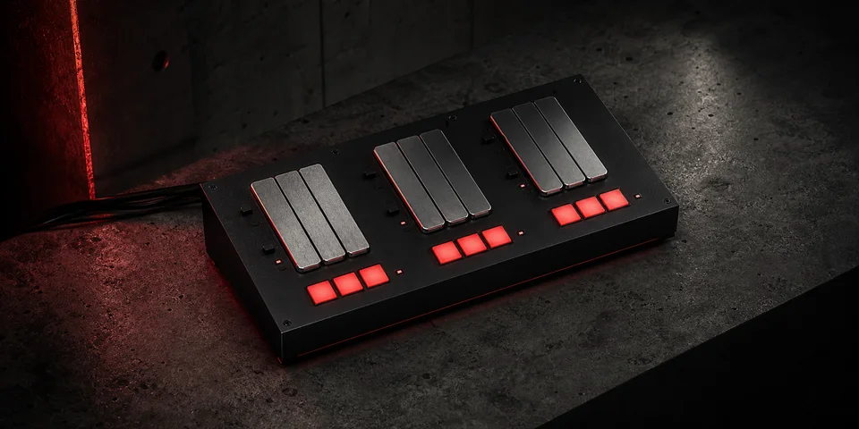 | 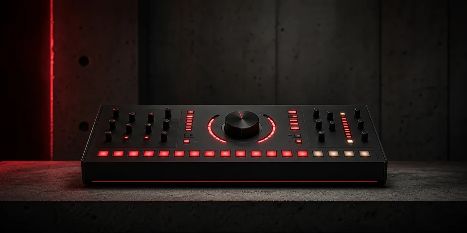 | 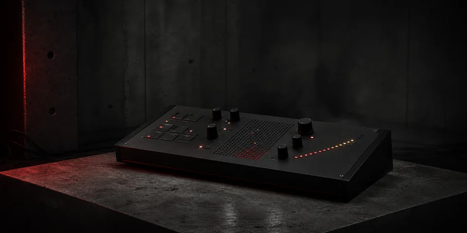 |
| Kick, Snare, Clap, Hats und Tom | Monophone Saw-/Square-Linie mit Accent und Slide | Kurze, skalensichere Akkordschläge | Hoover-, Pulse- und Siren-Klangfarben | Noise, Drone und Übergangseffekte |

## Szenenbogen

| Aufwärmen | Druck | Break | Peak |
| --- | --- | --- | --- |
| 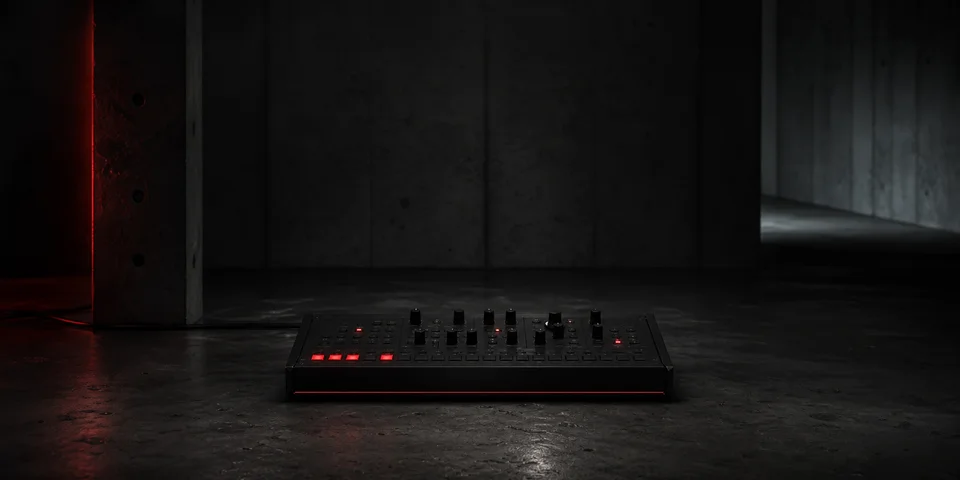 | 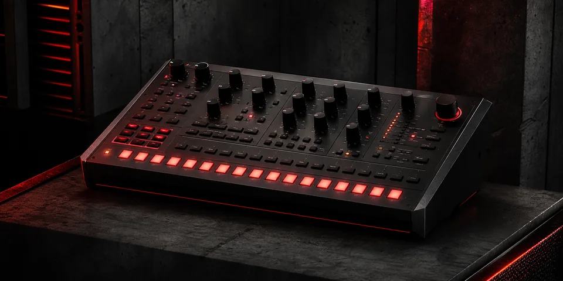 | 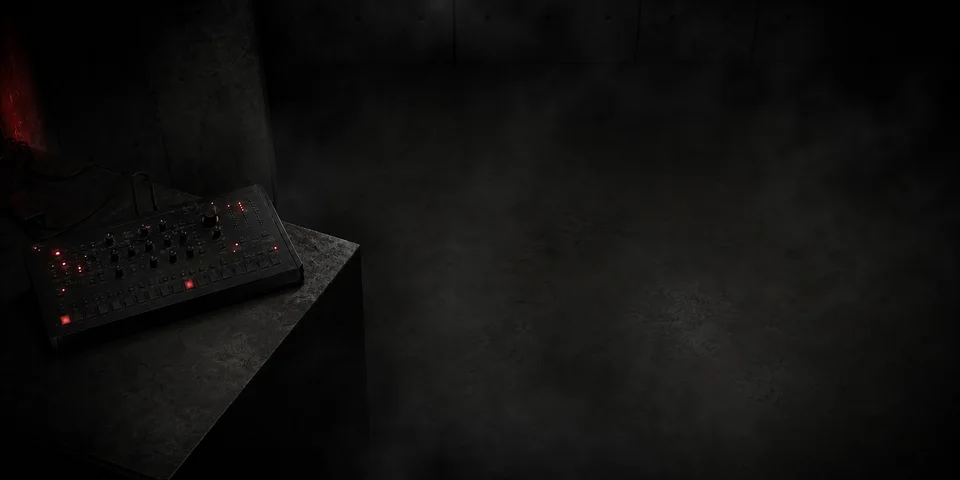 | 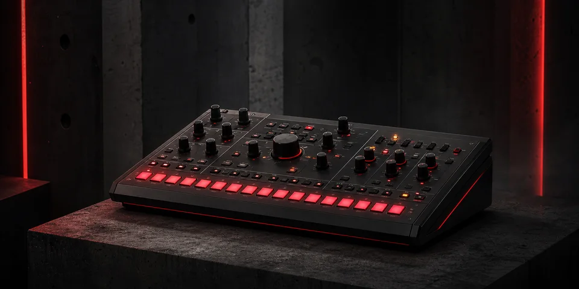 |
| Wenige Elemente und viel Platz | Stabiler Groove mit wachsendem Druck | Reduzierte Mitte für Übergänge | Volle, aber kontrollierte Energie |

Mit **Szenenfolge an** spielt Kitty die vier Szenen nacheinander und beginnt
danach wieder von vorn, jede Szene 4, 8 oder 16 Takte lang. Eine Szene, die du
dabei selbst anwählst, startet wie gewohnt am nächsten Takt; die Folge geht von
dort weiter. **Als WAV exportieren** rendert den ganzen Bogen oder die gewählte
Szene als Loop durch dieselbe Engine wie die Wiedergabe, schneller als in
Echtzeit (16 Bit, 44,1 kHz, Stereo). **Link teilen** packt das ganze Projekt
komprimiert in den Teil der Adresse hinter `#`; er wird nie an den Server
geschickt, und wer den Link öffnet, übernimmt eine eigene Kopie.

## Bedienung

- `Leertaste`: Start/Stop
- `1–5`: Drum Machine, Acid Bass, Stab, Rave Lead, Texture/FX
- `Umschalt+1–4`: Szene auswählen oder an der nächsten Taktgrenze vormerken
- `V`: Variation in der gewählten Stärke
- `R`: typisches Pattern für Spur und Profil
- `Strg/Cmd+Z`, `Strg/Cmd+Umschalt+Z` oder `Strg/Cmd+Y`: Rückgängig/Wiederholen
- Klick oder Enter: freien Step aktivieren, vorhandenen Step auswählen; ein
  zweiter Klick auf den ausgewählten Step schaltet ihn aus
- `Entf` oder `Rücktaste` im Raster, oder `Step ausschalten`: Step entfernen
- Pfeiltasten: im Raster von Step zu Step
- `?`: Hilfe mit allen Tastenkürzeln und der Einführungstour

Die Kürzel wirken überall außer in Eingabefeldern und Auswahllisten, also auch
direkt nach einem Klick auf einen Button. Nach einem Mausklick ist die
Leertaste Start/Stop; hat ein Button per Tastatur den Fokus, löst sie ihn aus.

Beim ersten Besuch führt eine kurze Tour durch Start, Auto-Acid, Szenen,
Spuren und Szenenfolge. Ein Zug an einem Regler ist ein einziger Undo-Schritt.
Solange Musik läuft, bleibt der Bildschirm an.

**Im Raster lesen:** Drum-Steps zeigen ihre Stimmen als Buchstaben (K Kick,
S Snare, C Clap, H Closed Hat, O Open Hat, T Tom), Steps der Melodiespuren die
Tonstufe als Zahl (1 Grundton bis 7 Septime). Mit **Vorhören** (an, abschaltbar
in den Step-Details) erklingt ein Step einmal, wenn du ihn bei gestoppter Musik
setzt oder änderst.

**Zugänglichkeit:** Jedes Bedienelement erklärt sich beim Überfahren und beim
Tastaturfokus in einem kurzen Hinweis, den Screenreader als Beschreibung
vorlesen; `Esc` schließt ihn. Ein Sprunglink führt direkt ins Step-Raster,
Regler nennen ihren Wert mit Einheit (BPM, %), und alle Texte erreichen
mindestens 4,5 : 1 Kontrast. Die Browser-Suite prüft das mit axe gegen
WCAG 2.2 AA.

**Im Raster:** Jeder Step hat eine **Chance** (100, 75, 50 oder 25 %), die bei
jedem Durchlauf neu würfelt, und Drums, Acid, Stab und Rave eine
**Wiederholung** (2–4 schnelle Schläge im Step). Jede Spur kann eine eigene
**Länge** bekommen (12–60 Steps); sie läuft gegen die vier Takte der Szene
weiter und verschiebt sich dabei (Polymetrik).

**Live spielen:** Die Live-Leiste nimmt mit **Aufnahme** (`A`) auf, was du
hörst, und speichert es als WAV. Mit **Live-Tasten** (`P`) schalten `1`–`5`
Spuren am nächsten Takt stumm. Der **Filter** federt beim Loslassen zurück
(`F` halten schließt, `Umschalt+F` öffnet). **Break → Drop** (`B` halten) nimmt
Kick und Acid heraus und lässt einen Hochpass steigen; beim Loslassen kommt der
Drop am nächsten Takt. Am Button rastet ein kurzes Tippen den Break ein, das
nächste bringt den Drop. Stumm sieht live wie im Mixer gleich aus:
bernsteinfarben und durchgestrichen. Nichts davon landet im Projekt oder in der
Undo-Liste.

**Auto-Acid:** Ein Klick auf **Auto-Acid** und Kitty spielt endlos Acid Techno
und regelt alles selbst. Die Musik läuft in Spannungsbögen: *Fluss* → *Aufbau*
→ *Break* → *Peak* → *Abbau*, der erste Bogen beginnt mit einem *Einstieg*.
Die Spannung des Moments bestimmt die Szene, Filter, Resonanz und Bewegung der
303, welche Spuren spielen (Stab und Rave Lead kommen erst mit steigender
Spannung dazu), einen Tiefpass, der sich im Einstieg öffnet, und einen
Hochpass-Riser am Ende jedes Aufbaus. Im Break spielt die 303 allein mit
hoher Resonanz, in den letzten zwei Takten nimmt **Break → Drop** Kick und Acid
heraus, und der Peak kommt mit dem Drop auf den Takt. Jeder Bogen verändert
die Acid-Linie, jeder dritte schreibt eine frische, jeder zweite wechselt den
Acid-Klang, jeder vierte rückt die Tonart eine Quarte höher. Ein Bogen ist
**kurz** (32 Takte), **mittel** (64) oder **lang** (88). Die Leiste zeigt Phase,
Takt, Bogen und die Spannung; geschützte Takte bleiben unberührt, und du kannst
jederzeit eingreifen. Alle Änderungen des Laufs sind zusammen ein einziger
Undo-Schritt: Nach dem Ausschalten holt `Strg+Z` die Musik von vorher zurück.
Gesichert wird währenddessen alle paar Sekunden.

**Gleichtakt:** Ist die Groovebox in einem zweiten Tab offen und dort wie hier
**Gleichtakt** an, starten und stoppen beide gemeinsam; wer startet, gibt das
Tempo vor, die andere App verdoppelt oder halbiert es bei Bedarf. **Stems**
im Export-Dialog liefern jede Spur als eigene WAV-Datei in einem ZIP.

**MIDI** (Chrome, Edge; Firefox nach Nachfrage): Kitty hört nur zu. Eine
MIDI-Clock gibt Tempo, Start und Stop vor, ohne das Tempo des Projekts zu
ändern; die Regler CC 70–74 steuern Farbe, Druck, Raum, Bewegung und Dichte der
gewählten Spur, jeder Regler lässt sich im MIDI-Dialog neu zuweisen.

Die Profile Hard, Acid und Hybrid werden ausschließlich beim bewussten
Erstellen eines neuen Projekts angewendet. Spätere Änderungen an Tempo,
Grundton oder Skala verändern das gespeicherte Profil und andere Projekte nicht.

## Architektur

Das npm-Workspace trennt die Vue-App in `apps/kitty` vom lokalen
`@kinky-vibes/ui`-Snapshot in `packages/ui`. Domainmodell, musikalischer
Generator, Sanitizing, Store, Speicherung, Bar-Queue und Tone.js-Engine sind
frameworkunabhängig; Vue-Komponenten bilden nur die Bedienoberfläche.

Der Audio-Mix nutzt pro Spur Eingangsfilter/EQ, lautheitskompensierte Sättigung,
Kompression und parallele vollständig-wet Delay-/Hall-Returns. Ein hörbarer
Kick duckt Acid, Stab, Rave und Texture tempoabhängig; der Master endet nach
Glue, Soft-Clip und Limiter in Fader und echtem dB-/Peak-Hold-Metering.
Filter, EQ, Chorus, Vibrato und alle Stimmen sind exakte Nachbauten der
Tone.js-Bausteine aus nativen Web-Audio-Knoten: Eine Sitzung braucht rund 500
statt 1.640 Knoten und spielt in Chromium ohne Aussetzer; ruhende Stimmbänke
werden bis zum nächsten Einsatz abgekoppelt. Ein Audiotest hält dieses Budget.

Der Speicher verwaltet höchstens acht benannte Projekte. Primärstände und die
jeweils letzte gültige Sicherung liegen unter versionierten `kitty.*.v1`-
Schlüsseln. Fremde oder beschädigte Werte werden vor Store und Audio-Engine in
die feste Struktur aus vier Szenen, fünf Spuren, vier Takten und 16 Steps
rekonstruiert und geklemmt. Unter **Projekte** lässt sich das aktive Projekt als
`.kitty.json` sichern; eine solche Datei (oder nacktes Projekt-JSON) öffnet
Kitty über „Datei öffnen …“ oder per Drag & Drop als neues Projekt, nach
demselben Sanitizing.

## Veröffentlichung

Kitty läuft unter
**[musik.jodie-oesterling.de/Kitty](https://musik.jodie-oesterling.de/Kitty/)**
als Teil der [Musik-Werkstatt](https://musik.jodie-oesterling.de/). Vite baut mit
dem Basis-Pfad `/Kitty/`. Veröffentlicht wird nur ein Commit auf `main`:
`scripts/musik-build.sh` im Repository `server-infra-nixos` exportiert ihn per
`git archive`, führt `npm run verify` mit der gepinnten Toolchain aus und baut
zusammen mit Groovebox und der Übersichtsseite ein Release;
`scripts/musik-deploy.sh` schaltet es atomar um und prüft jede Datei über HTTPS,
`scripts/musik-rollback.sh` kehrt zum vorherigen Release zurück.

## Grenzen

Kein Backend, Cloud-Sync, Sample-Import oder PWA; das Arrangement ist die feste
Szenenfolge. Fenster unter 1024 Pixel Breite, also Smartphone und Tablet, aber
auch ein stark vergrößerter Desktop, bekommen eine Hinweisseite mit Hörprobe;
dort lässt sich die volle Oberfläche trotzdem öffnen und seitlich scrollen. Referenzbrowser ist Chromium; Firefox läuft in der Smoke-Suite
mit (ohne MIDI-Clock-Tests). Safari ist ungetestet: Playwrights WebKit braucht
Ubuntu-Bibliotheken (ICU 74, libxml2.so.2, flite), die der Prüfrechner nicht hat.

Kitty steht unter der MIT-Lizenz. Herkunft und Lizenzen eingebetteter Assets
sind in [THIRD_PARTY_NOTICES.md](THIRD_PARTY_NOTICES.md) dokumentiert.

<!-- github-cicd-policy -->
## Local validation policy

This repository does not use GitHub Actions or any other GitHub-hosted CI/CD. Run tests, linters, builds, and all other checks locally before merging. A documented successful local test run is sufficient for review and merge.
<!-- /github-cicd-policy -->
