# Kitty · Visual Gallery

[Kitty im Browser öffnen](https://theanonymous.github.io/Kitty/) ·
[Zurück zur Projektübersicht](../README.md)

Diese textfreien Motive übersetzen Kittys musikalische Leitplanken in eine
gemeinsame Bildwelt aus schwarzem Metall, Beton, Signalrot und warmen
Akzenten. Die Dateien sind weboptimiert und können direkt für Projektseiten,
Ankündigungen oder redaktionelle Beiträge verwendet werden.

## Press Kit

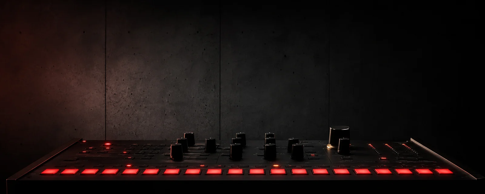

| Quadratisches Cover | Hochformat-Poster |
| --- | --- |
| 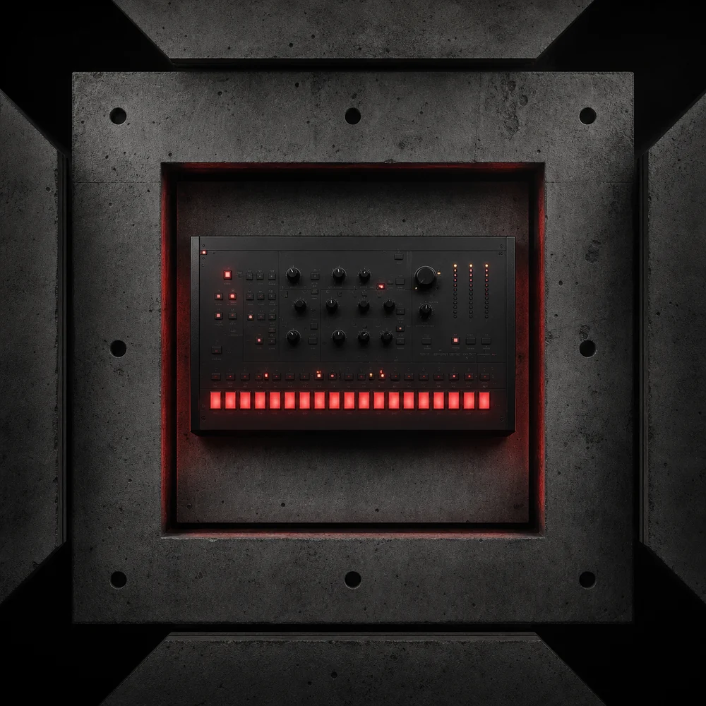 | 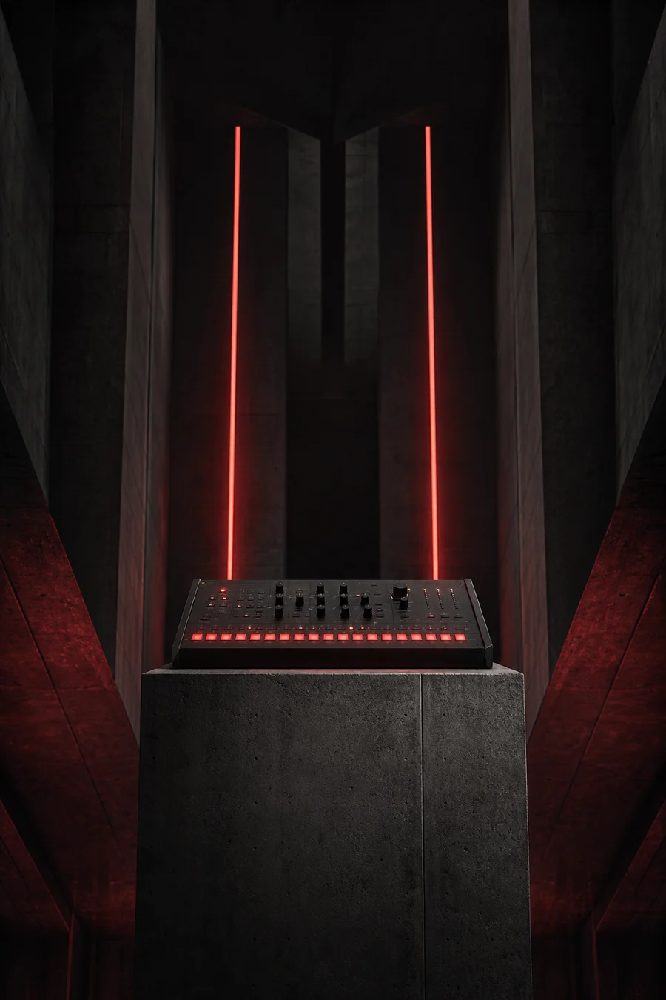 |
| 1000 × 1000 · Social und Cover | 900 × 1350 · Poster und Story |

Das Wide-Motiv liegt in 1600 × 640 Pixeln vor und bietet bewusst ruhige Fläche
für redaktionelle Überschriften. Alle drei Varianten bleiben selbst ohne Logo
oder Text als zusammengehörige Serie erkennbar.

## Fünf musikalische Makros

| Farbe | Druck | Raum |
| --- | --- | --- |
| 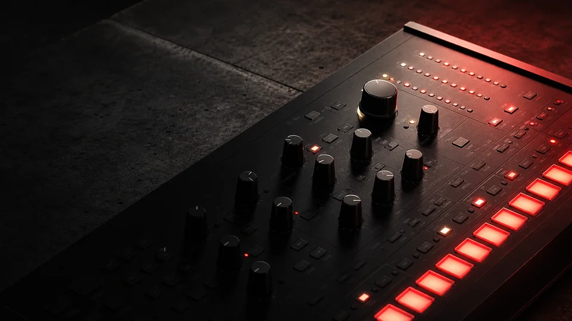 | 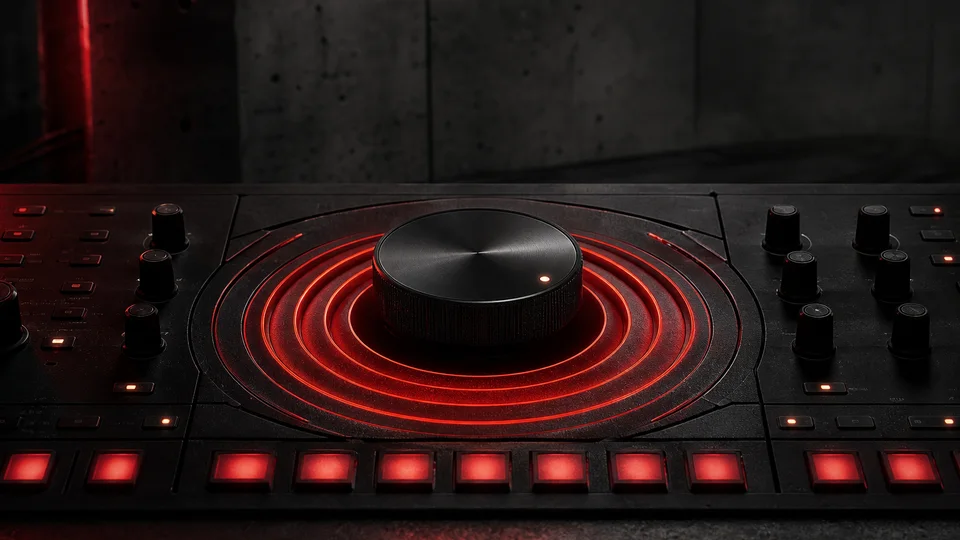 | 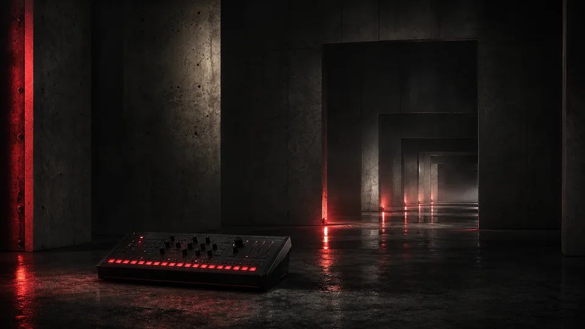 |
| Von dunkel und geschlossen bis hell und präsent | Mehr Punch und kontrollierte Verdichtung | Von trocken und nah bis weit und räumlich |

| Bewegung | Dichte |
| --- | --- |
| 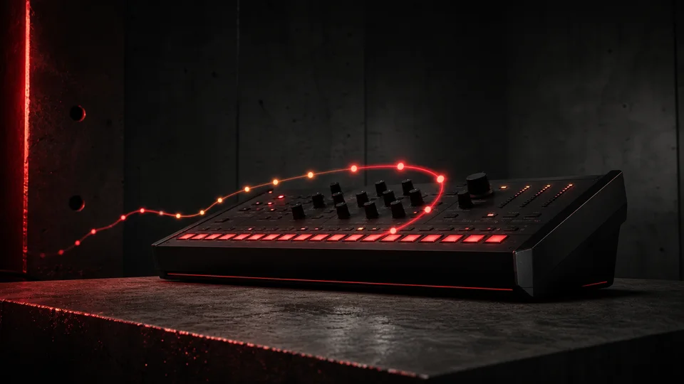 | 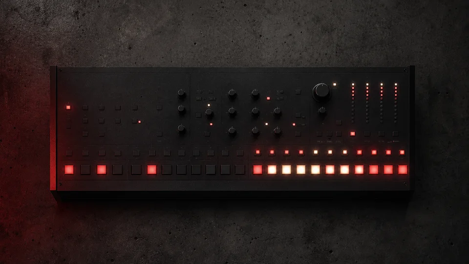 |
| Modulation und Delay bringen den Klang in Bewegung | Von wenigen Akzenten bis zum vollen, lesbaren Pattern |

## Workflow und Sicherheit

| Step-Bearbeitung | Szenen-Queue | Variation mit Sperren |
| --- | --- | --- |
| 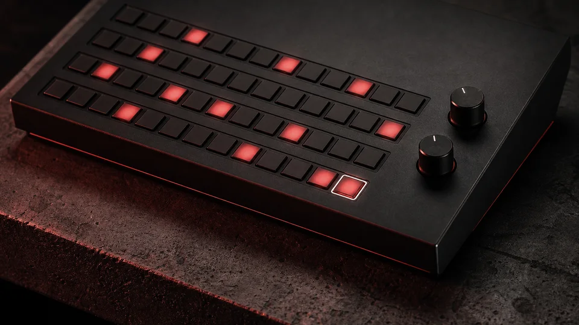 | 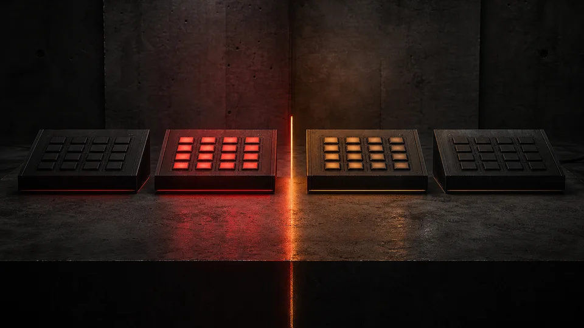 | 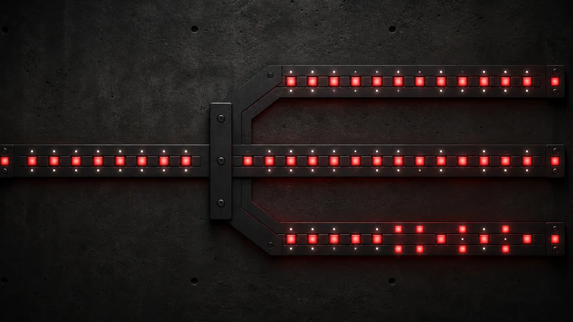 |
| Vorhandene Steps auswählen und gezielt editieren | Wechsel werden sauber an der Taktgrenze vorgemerkt | Tragende Anker bleiben auch bei mutigen Varianten erhalten |

| Skalensichere Tonalität | Lokale Projekte und Sicherung |
| --- | --- |
| 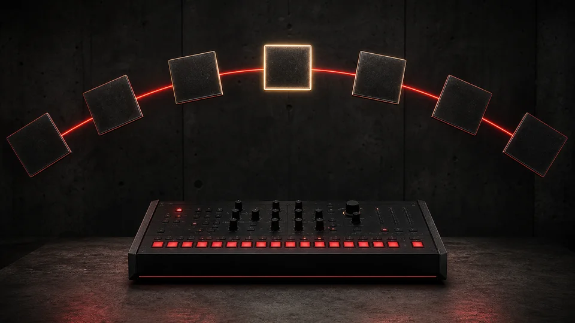 | 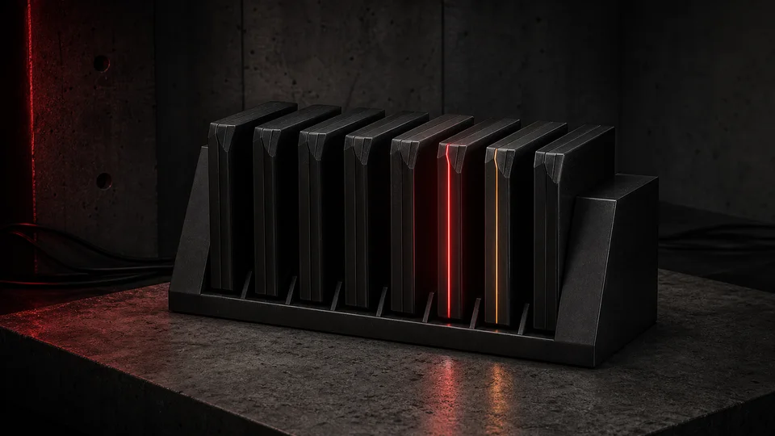 |
| Kuratierte Töne halten Bass, Stabs und Lead musikalisch zusammen | Bis zu acht Projekte bleiben lokal im Browser, inklusive gültiger Sicherung |

## Produktansicht

Für die tatsächliche Oberfläche und ihre zugänglichen Controls gibt es die
[große UI-Ansicht](assets/kitty-interface.webp). Die Galerie ist bewusst
konzeptionell; die laufende Anwendung bleibt die verbindliche Darstellung des
Produkts.
